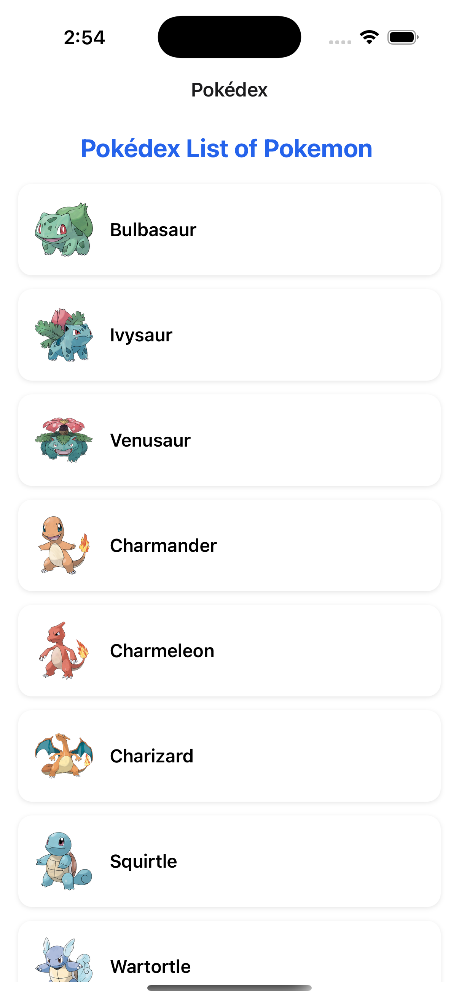
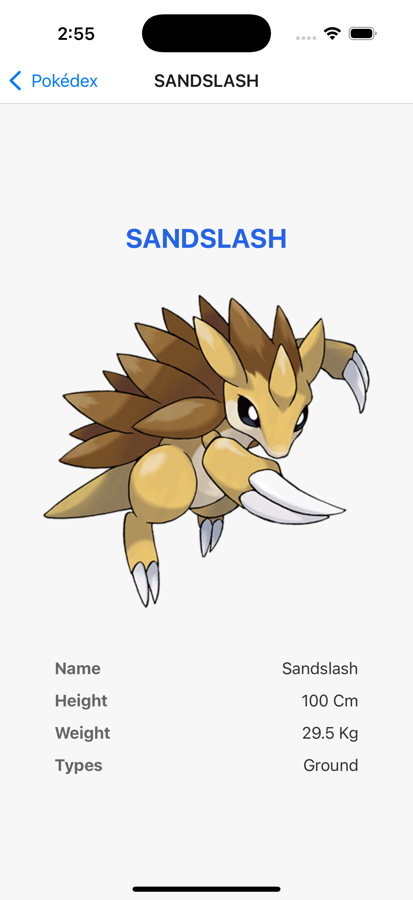
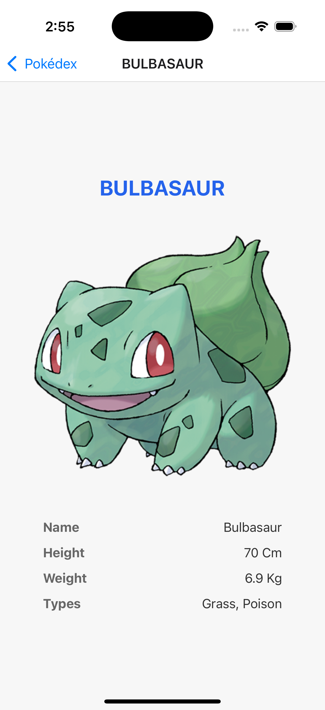

# 🧩 Pokédex — Pokémon Explorer App

A modern **React Native + Expo** app built with **Redux Toolkit Query**, **Reanimated**, and **TypeScript**, showcasing clean architecture, offline caching, and infinite scroll pagination powered by [PokéAPI](https://pokeapi.co/).

---

## 🚀 Features

✅ **Real-time Pokémon data** via PokéAPI
✅ **Offline caching** using AsyncStorage
✅ **Infinite scroll pagination** (load more on scroll)
✅ **Animated list items** with Reanimated (FadeIn + bounce effects)
✅ **Smooth image loader + bounce animation on details page**
✅ **100% functional tests with Jest** (>80% coverage)
✅ **Clean modular folder structure**
✅ **TypeScript with full typings**

---

## 🛠️ Installation

### 1️⃣ Clone the repo

```bash
git clone https://github.com/younisrahman/Pok-dex.git
cd Pok-dex
```

### 2️⃣ Install dependencies

```bash
npm install
# or
yarn install
```

### 3️⃣ Configure environment

Create a `.env` file in the root:

```bash
EXPO_PUBLIC_BASE_API_URL=https://pokeapi.co/api/v2/
```

(You can also copy from `.env.example`.)

### 4️⃣ Run the app

```bash
npx expo start
```

Press **i** to run on iOS simulator
Press **a** to run on Android emulator
Or scan the QR code with Expo Go.

---

## 👨‍💻 Scripts

| Command                 | Description             |
| ----------------------- | ----------------------- |
| `npm start`             | Start Expo dev server   |
| `npm run android`       | Run on Android emulator |
| `npm run ios`           | Run on iOS simulator    |
| `npm test`              | Run Jest test suite     |
| `npx jest --clearCache` | Clear Jest cache        |

---

## 🛠️ Project Structure

```bash
src/
├── api/
│   └── pokemonApi.ts            # RTK Query API definitions
├── components/
│   └── PokemonListItem.tsx      # Animated list item
├── screens/
│   ├── PokemonList/             # Home screen with infinite scroll
│   │   └── index.tsx
│   └── PokemonDetails/          # Pokémon details with bounce image
│       └── index.tsx
├── store/
│   └── index.ts                 # Redux store setup
├── utils/
│   ├── storage.ts               # AsyncStorage helpers
│   └── constants.ts             # App constants
└── tests/
    ├── PokemonListScreen.test.tsx
    ├── PokemonDetailScreen.test.tsx
    └── setup.ts
```

---

## 🧠 API Reference

All data comes from [PokéAPI](https://pokeapi.co/api/v2).

- **List Pokémons:** `GET /pokemon?offset=0&limit=20`
- **Details:** `GET /pokemon/{name}`

### Example Response

```json
{
  "count": 1302,
  "next": "https://pokeapi.co/api/v2/pokemon?offset=20&limit=20",
  "results": [
    { "name": "bulbasaur", "url": "https://pokeapi.co/api/v2/pokemon/1/" }
  ]
}
```

---

## 🔄 Infinite Scroll Logic

The app uses **offset-based pagination**:

- Each request fetches `limit=20` Pokémon.
- When the user scrolls near the bottom, new data auto-loads.
- When `data.next` is `null`, the app shows **“No more Pokémon 😢”**.

---

## 🧩 Animations

### 🌀 List

- Each card enters with `FadeInUp.delay(index * 80).springify()`.
- Smooth exit animation using `FadeOutDown`.

### 💫 Details Page

- Image starts with a **loading spinner**.
- After loading, it runs a **bounce scale** animation using `react-native-reanimated`.

---

## 🤕 Testing

All tests are powered by **Jest** and **@testing-library/react-native**.

### Run all tests

```bash
npm test
```

### Clear cache and retest

```bash
npx jest --clearCache
npm test
```

### Expected coverage

```

 PASS  src/tests/PokemonDetailScreen.test.tsx (5.779 s)
 PASS  src/tests/PokemonListScreen.test.tsx (5.892 s)
-------------------|---------|----------|---------|---------|-------------------
File               | % Stmts | % Branch | % Funcs | % Lines | Uncovered Line #s
-------------------|---------|----------|---------|---------|-------------------
All files          |   77.57 |       58 |   78.57 |   78.43 |
 api               |      80 |    66.66 |   66.66 |      80 |
  pokemonApi.ts    |      80 |    66.66 |   66.66 |      80 | 14
 ...PokemonDetails |   89.28 |    56.25 |    87.5 |      88 |
  index.tsx        |   89.28 |    56.25 |    87.5 |      88 | 42,58,90
 ...ns/PokemonList |      75 |    51.85 |   69.23 |   77.77 |
  index.tsx        |      75 |    51.85 |   69.23 |   77.77 | ...6,72-78,92,125
 utils             |   66.66 |      100 |     100 |   66.66 |
  constants.ts     |       0 |        0 |       0 |       0 |
  storage.ts       |   66.66 |      100 |     100 |   66.66 | 11,20-21,33,44-45
-------------------|---------|----------|---------|---------|-------------------

Test Suites: 2 passed, 2 total
Tests:       4 passed, 4 total
Snapshots:   0 total
Time:        6.499 s
Ran all test suites.

```

---

## 🧰 Technologies Used

- ⚛️ React Native + Expo
- 🧠 Redux Toolkit Query
- 💾 AsyncStorage (offline cache)
- 🎞️ Reanimated 3 (animations)
- 🧪 Jest + Testing Library
- 💅 TypeScript

---

## 🪄 Developer Notes

- The app gracefully handles **offline mode** with cached data.
- Pagination automatically stops when the API returns `next: null`.
- Components are **fully typed**, reusable, and optimized for performance.

---

## 🌐 Environment Variables

| Variable                   | Description              | Default                      |
| -------------------------- | ------------------------ | ---------------------------- |
| `EXPO_PUBLIC_BASE_API_URL` | Base API URL for PokéAPI | `https://pokeapi.co/api/v2/` |

---

## 📜 License

This project is licensed under the **MIT License**.
Feel free to modify and use it for your own learning or projects.

---

## ✨ Author

**👨‍💻 Md Younisur Rahman**
Senior Staff Software Engineer | Fintech & HealthTech Enthusiast
🌍 [LinkedIn](https://www.linkedin.com/in/md-younisur-rahman-107417105)
🧩 [GitHub](https://github.com/younisrahman)

---

### `.env.example`

```bash
# Base API URL for PokéAPI
EXPO_PUBLIC_BASE_API_URL=https://pokeapi.co/api/v2/
```

# Pok-dex

## 📸 Screenshots

| List Screen                                     | Details Screen                                         | Details Screen                                         |
| ----------------------------------------------- | ------------------------------------------------------ | ------------------------------------------------------ |
|  |  |  |

<h2>🎞️ Demo Preview</h2>

<video src="./ScreenShot/ScreenRecording.mp4" width="600" controls autoplay loop muted>
  Your browser does not support the video tag.
</video>

<br/>

<a href="./ScreenShot/ScreenRecording.mp4" download>
  🎬 <b>Download Demo Video</b>
</a>
